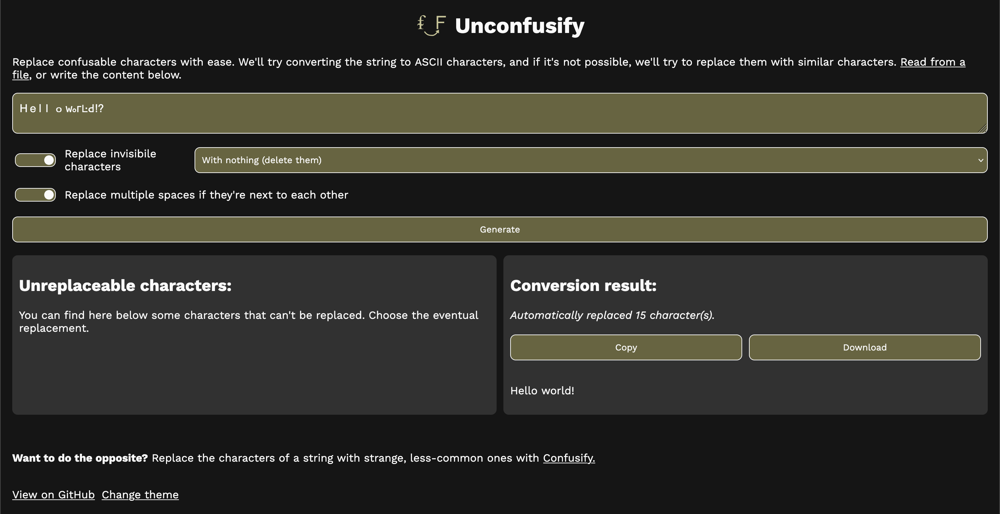

# Unconfusify

A tool that aims to replace strange and less-used characters with their most common counterparts.

## How it works:

Thanks to the [confusable list](https://www.unicode.org/Public/security/16.0.0/confusables.txt) of the Unicode Consortium, we have a list of characters that look similar to others. This webpage will try to convert each character of a string to an ASCII character.
- If the ASCII character is the same as the UTF-8, the character will be kept
- If not, the webpage will look if there's any "confusable" character that is part of the ASCII encoding
    * If yes, that confusable charachter will be added
    * If not, the original character will be kept the same, and the user will be able to change it in the "Replace character" window

### List generation

There are a few ways you can generate the list of confusable characters:
- Using a [Python script](./create_confusable_list.py), available in this repository. Make sure to install the `requests` library, and to specify as an argument the output file.
- With a [webpage](https://dinoosauro.github.io/Confusify/createList.html), available in [Confusify's repository](https://github.com/dinoosauro/Confusify).

## Screenshot:

